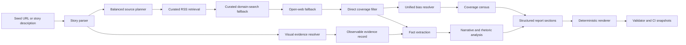

# Coding Agent Prompt for the Dev Branch Remediation Project

## Executive summary

Enabled connector used first: entity["organization","GitHub","code hosting platform"] only.

This prompt is designed to be pasted into a coding agent and executed against the `dev` branch of `TheThirdRail/third-rail-research-agent`. It assumes no explicit resource, latency, or cost constraints, so it prioritizes correctness, determinism, and regression resistance over thrift. The immediate architectural goal is to finish the deterministic path that the dev branch has already started: the repo now has a deterministic analysis service and renderer, a balanced source planner, a source registry, a story parser, a relevance scorer, and separate bias resolution logic, but the current composition still allows duplicated sections, soft bucket enforcement, text-only evidence handling, and unstable story narration order. fileciteturn98file0 fileciteturn99file0 fileciteturn95file0 fileciteturn96file0 fileciteturn100file0 fileciteturn101file0 fileciteturn115file0

The attached report from the latest run revealed the exact failure pattern this project must fix: missing `right_side` coverage, repeated Source Matrix/citation content, muddy separation between what is directly observable and what is interpretive, and an analytically narrow source set dominated by slight-left entries plus one far-left contextual source. Those are not cosmetic issues; they are acceptance-test failures for the product. fileciteturn90file0

This prompt therefore front-loads deterministic fixes in this order: renderer and structured handoff, canonical source registry and sync discipline, strict bucket enforcement plus exact-bias caps, and visual evidence ingestion. Only after those are in place should the coding agent deepen story parsing, relevance filtering, direct-coverage classification, narrative analysis, and expanded regression tests. That priority order matches the observed failure mode in the latest run and the current shape of the dev-branch code. fileciteturn98file0 fileciteturn99file0 fileciteturn95file0 fileciteturn105file0

## Methodology

I built this prompt from the dev-branch code paths the user explicitly requested be inspected: `analysis_service.py`, `report_renderer.py`, `source_aggregator_service.py`, `story_parser_service.py`, `rss_aggregator.py`, `article_extractor.py`, `bias_resolution_service.py`, `bias_classifier.py`, `config/source_registry.yaml`, `config/rss_feeds.yaml`, `config/bias_sources.yaml`, and relevant tests. I also incorporated the uploaded run report as a regression oracle for the practical failures the code needs to eliminate. The repo evidence shows that the dev branch already contains the key building blocks for deterministic reporting and source planning, but the handoff between services, agents, and renderer is still incomplete. fileciteturn98file0 fileciteturn99file0 fileciteturn95file0 fileciteturn96file0 fileciteturn100file0 fileciteturn101file0 fileciteturn102file0 fileciteturn105file0 fileciteturn106file0 fileciteturn119file0

For model and API recommendations, I prioritized current official documentation from entity["organization","OpenAI","ai company"]. The coding-model recommendation leans on the current model catalog and model-specific pages: `gpt-5.3-codex` is described as the most capable agentic coding model to date, `gpt-5.5` is the flagship model for complex reasoning and coding, `gpt-5.4` is framed as a frontier model for complex professional work, and `gpt-5.4-mini` is described as especially strong for coding, computer use, and subagents. Official API documentation also states that lower temperature yields more focused and deterministic outputs, and that the Responses API supports text and image inputs plus structured JSON outputs via Structured Outputs. citeturn2search1turn1search0turn2search2turn2search0turn4search0turn0search0turn0search1

## Coding agent prompt

I will work only against the `dev` branch. I will open one or more PRs **targeting `dev`**, not `main` or `master`. Every PR will include linked tests, linked CI status, a concise risk summary, and a before/after note explaining what user-visible failure it fixes.

I will treat the attached research PDF and source-matrix CSV as first-class regression artifacts. I will use them to reproduce the current problems, derive fixture data, and validate that I fixed the right things. I will not hard-code case-specific text into production logic; I will convert the report and matrix into sanitized fixtures or derived assertions that test behavior, not prose memorization.

I understand the current baseline before I change anything:

- The dev branch already centralizes orchestration through `analysis_service.py`, but the current handoff still passes the full crew report into `ReportSections(executive_summary=...)`, and the renderer then appends its own matrix and citation sections, which is why duplicated sections remain possible. fileciteturn98file0 fileciteturn99file0
- The repo already has a `BalancedSourcePlanner`, `SourceAggregatorService`, `SourceScorer`, duplicate handling, coverage summarization, a source registry, a story parser, a relevance scorer, and separate bias-resolution logic. The problem is not missing scaffolding; the problem is incomplete enforcement and incomplete structured handoff. fileciteturn95file0 fileciteturn96file0 fileciteturn100file0 fileciteturn101file0 fileciteturn103file0 fileciteturn115file0
- The current analysis path is not yet truly RSS-first for balanced analysis retrieval, even though discovery has RSS tooling and the RSS tool now supports category-aware behavior. fileciteturn109file0 fileciteturn110file0 fileciteturn111file0 fileciteturn95file0
- The current bucket semantics are too permissive for the user’s intent: the registry groups `-1`, `0`, and `+1` under `center_side`, and coverage summarization treats `abs(bias) <= 1` as center, which can mask a left-heavy set as “center-present.” fileciteturn106file0 fileciteturn95file0
- The article extraction path is still text-centric, so the pipeline cannot yet treat images or social-post media as first-class observable evidence. fileciteturn105file0
- The latest run demonstrated real regressions the code must eliminate: missing `right_side` coverage, duplicated source-matrix/citation sections, and muddled handling of what is visually observable versus what is merely interpreted. fileciteturn90file0

### Whole-project success definition

I am done with the whole project only when all of the following are true:

- A final report contains **exactly one** Source Matrix and **exactly one** all-sources/citations block.
- The report is rendered from structured section data; the renderer is not wrapping a full free-text report inside another report.
- The analysis path is **strictly** bucket-aware by policy, with hard behavior for missing required sides and a configurable exact-bias cap.
- The analysis path is truly **RSS-first** for curated source gathering, with domain-search and open-web fallback only after RSS attempts.
- Visual/social-post evidence is ingested into a structured observable-evidence record and is kept separate from interpretation and legal characterization.
- Story parsing and relevance filtering correctly distinguish direct coverage from contextual mention.
- The report tells the story first, then explains what is observable, then what is disputed, then how different outlets frame it.
- Regression tests derived from the attached PDF and source-matrix CSV pass in CI.
- Every PR into `dev` shows green tests and links the relevant CI checks.

### Phase success definitions

#### Planning done-when

I am done with Planning when I have produced a committed remediation plan, mapped the current code paths by file, written down assumptions and risks, and defined pass/fail acceptance criteria for every task that follows.

#### Research done-when

I am done with Research when I have converted the attached PDF and source-matrix CSV into reproducible regression fixtures or derived expected-behavior assertions, and I have documented exactly how each observed failure maps to a specific code path.

#### Coding done-when

I am done with Coding when the P0 tasks are merged or ready in PRs with passing CI, the P1 tasks are implemented or explicitly deferred with rationale, the P2 tasks have regression coverage, and the final report shape is story-first, non-duplicative, visually aware, and ideologically enforceable.

### Improved workflow

### P0 task table

| Task ID | Priority | Effort | Core files | Done-when |
|---|---|---:|---|---|
| P0-A | P0 | 4-6h | `src/services/analysis_service.py`, `src/services/report_renderer.py`, new schema file | Renderer no longer wraps a full crew report inside `executive_summary`; one matrix only |
| P0-B | P0 | 3-5h | `src/services/report_validator.py`, new renderer regression tests | Duplicate core sections fail validation and tests |
| P0-C | P0 | 5-8h | `config/source_registry.yaml`, `config/bias_sources.yaml`, `config/rss_feeds.yaml`, sync script(s) | Source registry is authoritative and sync discipline is enforced |
| P0-D | P0 | 6-10h | `src/services/source_aggregator_service.py`, `src/services/balanced_source_planner.py`, `src/services/source_scoring.py`, `src/core/config.py` | Missing required sides no longer silently backfill with same-bias sources |
| P0-E | P0 | 6-10h | `src/services/source_aggregator_service.py`, `src/tools/rss_aggregator.py`, possibly new RSS retrieval helper | Analysis-time retrieval becomes truly RSS-first |
| P0-F | P0 | 8-14h | `src/tools/article_extractor.py`, new `src/services/visual_evidence_service.py`, `src/services/analysis_service.py` | Images/social posts become structured observable evidence |

### Detailed checklist document

#### Planning phase checklist

##### PLAN-A Create the committed remediation plan and project checklist

I will create a committed project plan so the implementation becomes auditable rather than conversational. The dev branch already has enough moving pieces that I should not improvise the order of changes. fileciteturn98file0 fileciteturn95file0

- **Files to change or create**
  - New: `docs/implementation/dev-remediation-plan.md`
  - New: `docs/implementation/dev-remediation-checklist.md`
- **Exact code or behavior changes**
  - No runtime code change.
  - Commit a written implementation plan that maps each observed issue to the exact file(s) that control it.
  - Record decision points: exact-center policy, exact-bias cap, missing-side behavior, fixture strategy, and PR slicing.
- **Tests to add**
  - None.
- **Acceptance criteria**
  - **Pass:** Both docs exist, list all tasks below, and match the actual PR plan.
  - **Fail:** The work proceeds without a committed file map and explicit acceptance criteria.
- **Priority**
  - P0
- **Estimated effort**
  - 1-2 hours

##### PLAN-B Build regression fixtures from the attached PDF and source-matrix CSV

The latest run is not just narrative feedback; it is a regression input. The attached report proved the current failure pattern, so I need fixtures that keep those bugs from returning. fileciteturn90file0

- **Files to change or create**
  - New: `tests/fixtures/comey_case/source_matrix.csv`
  - New: `tests/fixtures/comey_case/report_expectations.json`
  - New: `tests/fixtures/comey_case/README.md`
  - Optional new derived text fixture instead of raw PDF binary if repository size or legal concerns apply
- **Exact code or behavior changes**
  - Convert the attached CSV into a sanitized fixture preserving bias counts, domains, and duplicates.
  - Derive expected assertions from the attached report:
    - exactly one Source Matrix
    - exactly one citations block
    - missing-right-side warning
    - story-first ordering requirement
    - observable vs interpretation split requirement
- **Tests to add**
  - New regression test skeleton referenced by later tasks
- **Acceptance criteria**
  - **Pass:** The repo contains fixture data and documented expected behavior derived from the attachments.
  - **Fail:** The issues remain only in prose and are not encoded into tests.
- **Priority**
  - P0
- **Estimated effort**
  - 2-3 hours

##### PLAN-C Map current tests and CI responsibilities

The relevant inspected tests currently emphasize prompt formatting and crew structure, which is useful but not enough for renderer, bucket-enforcement, or visual-evidence regressions. fileciteturn112file0 fileciteturn113file0

- **Files to change or create**
  - New: `docs/implementation/test-plan.md`
  - Existing CI workflow files under `.github/workflows/` if present, otherwise new `test.yml`
- **Exact code or behavior changes**
  - Map existing tests versus missing regression categories.
  - Define required gates for future PRs:
    - unit
    - renderer snapshot
    - end-to-end regression
    - fixture-based bucket enforcement
- **Tests to add**
  - None in this item
- **Acceptance criteria**
  - **Pass:** The test plan enumerates each missing regression class and the workflow that should run it.
  - **Fail:** PRs ship without a clear CI gate map.
- **Priority**
  - P0
- **Estimated effort**
  - 1-2 hours

#### Research phase checklist

##### RESEARCH-A Produce a current-state architecture note

The current code already contains the services I need to finish, so the architecture note should show what exists versus what is still free-form. fileciteturn98file0 fileciteturn99file0 fileciteturn95file0 fileciteturn96file0 fileciteturn100file0 fileciteturn101file0

- **Files to change or create**
  - New: `docs/implementation/current-state-architecture.md`
- **Exact code or behavior changes**
  - No runtime change.
  - Document:
    - current analysis flow
    - current discovery flow
    - current bias resolution path
    - current renderer handoff
    - current source registry and bucket semantics
- **Tests to add**
  - None.
- **Acceptance criteria**
  - **Pass:** The note correctly identifies which logic is deterministic versus prompt-driven.
  - **Fail:** Architectural decisions are made without a current-state map.
- **Priority**
  - P0
- **Estimated effort**
  - 2 hours

##### RESEARCH-B Write the observable-versus-interpretive evidence contract

The latest run showed why this contract is necessary: what is visibly in an image or post must be stored separately from what that image is alleged to mean. fileciteturn90file0 fileciteturn105file0

- **Files to change or create**
  - New: `docs/implementation/evidence-contract.md`
  - Optional new schema file later used in code
- **Exact code or behavior changes**
  - Define four evidence layers:
    - `observable`
    - `reported_context`
    - `interpretation`
    - `legal_characterization`
- **Tests to add**
  - None at this stage
- **Acceptance criteria**
  - **Pass:** The contract is explicit and will drive both parser and report rendering.
  - **Fail:** Observable facts and interpretation continue to bleed together.
- **Priority**
  - P0
- **Estimated effort**
  - 1-2 hours

#### Coding phase checklist

##### P0-A Fix the structured report handoff and renderer composition bug

The current dev branch already has a deterministic renderer, but `analysis_service.py` still feeds the full crew report into `ReportSections(executive_summary=crew_report)`, which makes duplication almost inevitable. That is the first bug to kill. fileciteturn98file0 fileciteturn99file0

- **Files to change or create**
  - `src/services/analysis_service.py`
  - `src/services/report_renderer.py`
  - New: `src/schemas/analysis_report_sections.py` or equivalent
  - `src/agents/report_writer.py`
  - `src/crews/analysis_crew.py`
- **Exact code or behavior changes**
  - Replace the current free-text report handoff with a strict structured schema for report sections.
  - Make the report writer return structured JSON or Pydantic output instead of a fully rendered Markdown report.
  - Populate `ReportSections` field by field.
  - Ensure `ReportRenderer` is the **only** component responsible for layouting the final markdown.
  - Remove any path that wraps an already-rendered report inside a second renderer.
- **Tests to add**
  - New: `tests/test_report_renderer_single_matrix.py`
  - New: `tests/test_analysis_service_structured_handoff.py`
- **Acceptance criteria**
  - **Pass:** Final markdown contains exactly one Source Matrix, one all-sources/citations block, and one executive summary.
  - **Fail:** Any doubled core section appears in renderer snapshots.
- **Priority**
  - P0
- **Estimated effort**
  - 4-6 hours

##### P0-B Add duplicate-section validation and renderer snapshot coverage

The current validator checks source integrity but does not appear to guard against duplicate section composition. That must become explicit. fileciteturn102file0

- **Files to change or create**
  - `src/services/report_validator.py`
  - New: `tests/test_report_validator_duplicate_sections.py`
  - New: `tests/snapshots/` fixtures as needed
- **Exact code or behavior changes**
  - Add validator rules that fail when the final markdown contains more than one:
    - `## Source Matrix`
    - `## All Sources & Citations`
    - `## Executive Summary`
  - Add renderer snapshot assertions for section order and singularity.
- **Tests to add**
  - Duplicate-section validator test
  - Snapshot test for section order and count
- **Acceptance criteria**
  - **Pass:** Duplicated Source Matrix or citations block fails validation and tests.
  - **Fail:** A duplicate matrix can still reach final output.
- **Priority**
  - P0
- **Estimated effort**
  - 3-5 hours

##### P0-C Make `config/source_registry.yaml` authoritative and enforce sync discipline

The dev branch already has `config/source_registry.yaml`, while `config/bias_sources.yaml` still exists as a large domain map. The correct next step is to make the source registry authoritative and ensure derivative configs stay synchronized. fileciteturn106file0 fileciteturn119file0

- **Files to change or create**
  - `config/source_registry.yaml`
  - `config/bias_sources.yaml`
  - `config/rss_feeds.yaml`
  - New: `scripts/sync_source_configs.py`
  - New: `tests/test_source_registry_sync.py`
- **Exact code or behavior changes**
  - Declare `source_registry.yaml` the canonical source of truth.
  - Generate or validate `bias_sources.yaml` and `rss_feeds.yaml` from it.
  - Add a sync/validation script that fails when the derivative configs drift from the registry.
  - Preserve per-source fields such as bias, faction/category, factuality, RSS URLs, search aliases, and allow/deny flags.
- **Tests to add**
  - Registry-to-derived-config parity test
  - Sync-script smoke test
- **Acceptance criteria**
  - **Pass:** One canonical registry drives or verifies derivative configs.
  - **Fail:** Bias/feed config drift can occur silently.
- **Priority**
  - P0
- **Estimated effort**
  - 5-8 hours

##### P0-D Enforce strict bucket policy and exact-bias caps in source retention

The current planner and aggregator already compute coverage and score sources, but the enforcement is still soft, and `abs(bias) <= 1` is too permissive for the user’s actual requirement. fileciteturn95file0 fileciteturn96file0 fileciteturn103file0 fileciteturn106file0 fileciteturn107file0

- **Files to change or create**
  - `src/services/source_aggregator_service.py`
  - `src/services/balanced_source_planner.py`
  - `src/services/source_scoring.py`
  - `src/core/config.py`
  - New: `tests/test_strict_bucket_enforcement.py`
  - New: `tests/test_exact_bias_cap.py`
- **Exact code or behavior changes**
  - Add explicit policy knobs:
    - `exact_center_required`
    - `required_bucket_groups`
    - `max_per_exact_bias`
    - `max_per_bucket_group`
    - `allow_same_bias_backfill`
  - Default policy:
    - at least one left-ish source
    - at least one right-ish source
    - optionally one exact-center source when available
  - Enforce hard behavior when required groups are missing:
    - fail fast, or
    - return incomplete coverage status without padding with same-bias sources
  - Penalize or hard-cap duplicate exact-bias picks once represented.
- **Tests to add**
  - Missing-right-side hard-fail or incomplete-status test
  - Four `-1` plus one `-4` selection rejection test
  - Exact-bias cap test
- **Acceptance criteria**
  - **Pass:** The system cannot silently fill an ideologically missing side with more same-side sources.
  - **Fail:** A retained source set can still include repeated exact-bias backfill by default.
- **Priority**
  - P0
- **Estimated effort**
  - 6-10 hours

##### P0-E Make analysis-time retrieval truly RSS-first

Discovery already has RSS support, and the RSS tool now supports category-aware use, but analysis-time curated acquisition is still effectively search-first. That must change. fileciteturn109file0 fileciteturn110file0 fileciteturn111file0 fileciteturn95file0

- **Files to change or create**
  - `src/services/source_aggregator_service.py`
  - `src/tools/rss_aggregator.py`
  - Optional new: `src/services/rss_retrieval_service.py`
  - `src/services/balanced_source_planner.py`
  - New: `tests/test_analysis_rss_first_retrieval.py`
- **Exact code or behavior changes**
  - Insert an analysis-time RSS retrieval stage ahead of domain-search fallback.
  - For each required ideological bucket:
    - fetch candidate feed items from curated feeds
    - rank by story-packet similarity
    - only then fall back to domain search
    - only then fall back to broader open web
  - Rename misleading phase labels so `rss_curated` means actual RSS usage, not search-engine `site:` queries.
- **Tests to add**
  - RSS-first ordering test
  - Fallback-order test
  - Bucket-aware RSS retrieval test
- **Acceptance criteria**
  - **Pass:** Analysis-time source retrieval uses RSS first for curated outlets.
  - **Fail:** The path still jumps straight into news search before curated RSS attempts.
- **Priority**
  - P0
- **Estimated effort**
  - 6-10 hours

##### P0-F Add visual evidence ingestion for images and social posts

The article extractor is still text-centric, which means the system cannot yet treat image content or embedded social-post media as first-class evidence. The API stack you should use supports image input and structured output, so the missing piece is repo integration, not vendor capability. fileciteturn105file0 citeturn0search0turn0search1turn1search0turn4search0

- **Files to change or create**
  - `src/tools/article_extractor.py`
  - New: `src/services/visual_evidence_service.py`
  - `src/services/analysis_service.py`
  - New: `tests/test_visual_evidence_service.py`
  - New fixtures for image/social-post metadata
- **Exact code or behavior changes**
  - Extend `ArticleExtractor` to capture:
    - `og_image_url`
    - `embedded_post_urls`
    - `image_alt_text`
    - `media_captions`
  - Add a `VisualEvidenceService` that turns media into a structured observable-evidence record.
  - Feed image/post URLs into a vision-capable model path using the Responses API.
  - Store output fields such as:
    - `observable_text`
    - `visible_symbols_or_numbers`
    - `observable_objects`
    - `platform`
    - `confidence`
    - `source_url`
  - Keep this evidence separate from interpretation and legal framing.
- **Tests to add**
  - Service unit test with mocked image/post metadata
  - Observable-vs-interpretive schema test
- **Acceptance criteria**
  - **Pass:** A story centered on an image or social post can produce structured observable evidence before interpretation begins.
  - **Fail:** The system still has only text excerpts and no visual observation path.
- **Priority**
  - P0
- **Estimated effort**
  - 8-14 hours

##### P1-A Strengthen `StoryParserService` for distinctive tokens and dispute framing

The current parser is already better than nothing, but it is still largely heuristic and needs to elevate highly distinctive tokens like quoted numbers, short codes, platform context, and visual descriptors. fileciteturn100file0

- **Files to change or create**
  - `src/services/story_parser_service.py`
  - New: `tests/test_story_parser_distinctive_tokens.py`
- **Exact code or behavior changes**
  - Expand parsing to extract:
    - quoted numbers
    - short alphanumeric strings
    - platform names
    - media descriptors
    - observable/disputed term candidates
    - stronger `must_have_terms`
    - stronger `must_not_have_terms`
  - Output a richer story packet for downstream retrieval and narrative stages.
- **Tests to add**
  - Distinctive-token extraction test
  - Must-have/must-not-have query-pack test
- **Acceptance criteria**
  - **Pass:** Distinctive tokens materially constrain retrieval and relevance scoring.
  - **Fail:** The parser still behaves like a generic headline summarizer.
- **Priority**
  - P1
- **Estimated effort**
  - 4-6 hours

##### P1-B Tighten relevance scoring and add direct-coverage classification

The relevance scorer already exists, but contextual mention and adjacent-topic pieces still have too much opportunity to survive into the retained set. fileciteturn101file0 fileciteturn90file0

- **Files to change or create**
  - `src/services/relevance_scorer_service.py`
  - `src/services/source_aggregator_service.py`
  - New: `tests/test_relevance_direct_vs_contextual.py`
- **Exact code or behavior changes**
  - Add `coverage_type` classification:
    - `direct`
    - `contextual`
    - `mention`
    - `opinion`
    - `wire`
  - Raise the rejection bar for contextual drift.
  - Require strong overlap on core event markers, not just broad person/topic overlap.
  - Use direct-coverage status as a retention filter.
- **Tests to add**
  - Direct-vs-contextual rejection test
  - Same-person/wrong-event rejection test
- **Acceptance criteria**
  - **Pass:** Contextual mention pieces do not survive into the retained evidence set by default.
  - **Fail:** A source can remain solely because it mentions the headline actor or broad event family.
- **Priority**
  - P1
- **Estimated effort**
  - 4-6 hours

##### P1-C Unify bias classification through the bias-resolution path

The dev branch already has separate bias-resolution logic and a bias-classifier tool path. The right fix is one authoritative resolution path with provenance. fileciteturn115file0 fileciteturn116file0 fileciteturn119file0

- **Files to change or create**
  - `src/services/bias_resolution_service.py`
  - `src/tools/bias_classifier.py`
  - `src/services/source_aggregator_service.py`
  - New: `tests/test_bias_resolution_path_order.py`
- **Exact code or behavior changes**
  - Use one authoritative service for bias resolution everywhere.
  - Prefer curated/domain-map answers first.
  - Persist provenance:
    - curated registry
    - AllSides-style map
    - model inference
    - heuristic fallback
  - Ensure missing or unknown domains are cached for review.
- **Tests to add**
  - Known-domain short-circuit test
  - Unknown-domain fallback-order test
- **Acceptance criteria**
  - **Pass:** All source resolution paths use one bias-resolution service with provenance.
  - **Fail:** Different code paths can still disagree about the same domain.
- **Priority**
  - P1
- **Estimated effort**
  - 3-5 hours

##### P1-D Tighten `source_aggregator` agent behavior when prefetched sources exist

When `prefetched_sources` are already supplied, the source-aggregator agent should not behave like an exploratory search agent. The prompt already tells it to use the prefetched set; the tools and orchestration should reinforce that. fileciteturn109file0 fileciteturn92file0 fileciteturn98file0

- **Files to change or create**
  - `src/agents/source_aggregator.py`
  - `src/crews/analysis_crew.py`
  - Optional new analysis-only agent wrapper
  - New: `tests/test_source_aggregator_prefetched_mode.py`
- **Exact code or behavior changes**
  - In prefetched mode:
    - remove or disable external search tools
    - force the agent to operate only on supplied sources
  - In exploratory mode:
    - keep tools enabled
  - Make the mode explicit in the agent/task interface.
- **Tests to add**
  - Prefetched-mode tool-usage prohibition test
  - Exploratory-mode tool-availability test
- **Acceptance criteria**
  - **Pass:** When prefetched sources are present, the agent cannot drift into open search behavior.
  - **Fail:** Tool-enabled exploratory behavior still occurs in prefetched mode.
- **Priority**
  - P1
- **Estimated effort**
  - 3-4 hours

##### P1-E Surface a coverage census in the final report

The source aggregator already computes useful coverage counts. They should become a first-class report artifact rather than hidden debug metadata. fileciteturn95file0 fileciteturn98file0

- **Files to change or create**
  - `src/services/source_aggregator_service.py`
  - `src/services/report_renderer.py`
  - New: `tests/test_coverage_census_rendering.py`
- **Exact code or behavior changes**
  - Add a rendered coverage snapshot section with:
    - discovered-by-bias
    - extractable-by-bias
    - retained-by-bias
    - exact bias counts and grouped counts
    - missing-bucket explanations
  - Keep it concise but explicit.
- **Tests to add**
  - Coverage-census render test
  - Exact-bias count formatting test
- **Acceptance criteria**
  - **Pass:** The report visibly explains what the ecosystem covered versus what the pipeline retained.
  - **Fail:** Coverage statistics remain hidden or too vague to debug retrieval failures.
- **Priority**
  - P1
- **Estimated effort**
  - 3-5 hours

##### P2-A Integrate `narrative_analyzer` into a structured, story-first report flow

Dev already contains a `narrative_analyzer` agent file and the database model already has narrative-related fields, so the next step is formal integration into a structured, evidence-bound flow rather than letting the final writer improvise everything. fileciteturn93file0 fileciteturn114file0 fileciteturn98file0

- **Files to change or create**
  - `src/agents/narrative_analyzer.py`
  - `src/crews/analysis_crew.py`
  - `src/services/analysis_service.py`
  - `src/services/report_renderer.py`
  - New: `tests/test_narrative_analyzer_structured_output.py`
- **Exact code or behavior changes**
  - Feed structured claims, visual observations, source coverage, and rhetoric outputs into `narrative_analyzer`.
  - Require structured output fields such as:
    - mainstream narrative
    - alternative or counter-narrative patterns
    - omissions by side
    - creator-angle suggestions
  - Use these structured fields in the renderer rather than free-form synthesis alone.
- **Tests to add**
  - Structured narrative output test
  - Source-traceability test for narrative claims
- **Acceptance criteria**
  - **Pass:** Narrative analysis is evidence-bound, structured, and separate from pure rendering.
  - **Fail:** Narratives are still improvised entirely inside the final report-writing step.
- **Priority**
  - P2
- **Estimated effort**
  - 5-8 hours

##### P2-B Reorder the report to a story-first layout

The report must help the reader understand what happened before critiquing how different outlets framed it. The attached report is the proof that the old order is too repetitive and too hard to parse. fileciteturn90file0 fileciteturn99file0

- **Files to change or create**
  - `src/services/report_renderer.py`
  - `src/agents/report_writer.py`
  - New: `tests/test_story_first_layout.py`
- **Exact code or behavior changes**
  - Reorder the output to:
    - What happened
    - What is directly observable
    - What is disputed
    - Coverage snapshot
    - Source Matrix
    - Bias / rhetoric / omissions
    - Creator angles
    - Video outline
  - Consolidate overlapping dispute/ambiguity sections.
- **Tests to add**
  - Story-first heading-order test
  - Section-duplication regression test
- **Acceptance criteria**
  - **Pass:** The report explains the event before media analysis begins.
  - **Fail:** The reader still has to infer the event from rhetorical-analysis sections.
- **Priority**
  - P2
- **Estimated effort**
  - 3-5 hours

##### P2-C Add CI-enforced regression and snapshot gates for this project

The inspected tests are not yet enough to prevent the specific regressions this project is trying to eliminate. CI must become the enforcement mechanism, not just a courtesy. fileciteturn112file0 fileciteturn113file0

- **Files to change or create**
  - Existing workflow(s) under `.github/workflows/` if present
  - Otherwise new: `.github/workflows/test.yml`
  - `tests/` additions from all items above
- **Exact code or behavior changes**
  - Add CI jobs for:
    - unit tests
    - renderer snapshots
    - bucket-enforcement tests
    - visual-evidence tests
    - regression fixtures from attached report/matrix
  - Make the PR template require linked CI status and test list.
- **Tests to add**
  - CI configuration validation as appropriate
- **Acceptance criteria**
  - **Pass:** PRs into `dev` show green tests for the new regression classes.
  - **Fail:** A PR can merge or be reviewed without these gates.
- **Priority**
  - P2
- **Estimated effort**
  - 2-4 hours

### PR requirements

I will slice the work into at least these PRs unless a smaller split is obviously cleaner:

- **PR 1**
  - Renderer handoff
  - duplicate-section validation
  - baseline regression fixtures
- **PR 2**
  - source registry sync discipline
  - strict bucket enforcement
  - exact-bias caps
  - RSS-first analysis retrieval
- **PR 3**
  - visual evidence ingestion
  - story parser and relevance upgrades
  - direct-coverage classifier
- **PR 4**
  - narrative analyzer integration
  - story-first layout
  - CI hardening and regression pack finalization

Every PR body will include:

- target branch: `dev`
- summary of behavior changes
- files changed
- tests added
- CI links
- pass/fail acceptance checklist
- risk notes
- rollback notes

## Model settings for the coding workflow

For the **agent-runner**, I recommend **`GPT-5.3-Codex` at temperature `0.1`**. Official model documentation describes `gpt-5.3-codex` as the most capable agentic coding model to date and specifically optimized for agentic coding tasks in Codex-like environments. A low temperature is the right default for deterministic file edits, test writing, and refactors because the API reference states that lower temperatures make outputs more focused and deterministic. citeturn2search1turn4search0

For the **coding-reviewer**, I recommend **`GPT-5.5` at temperature `0.0` or `0.1`**. The official model guide recommends `gpt-5.5` as the flagship model for complex reasoning and coding, which makes it the best review model when the job is architectural consistency, bug-finding, regression scrutiny, and cross-file reasoning. Again, low temperature is correct here because review quality improves when the output is stable, evidence-bound, and non-creative. citeturn1search0turn2search3turn4search0

For the repo’s own future report-generation and structured-analysis stages, I should prefer the Responses API plus Structured Outputs rather than free-form JSON-mode prompting, because official docs explicitly recommend Structured Outputs for schema adherence and note that the Responses API supports text and image inputs together with structured JSON outputs. That is directly relevant to the renderer rewrite and the visual-evidence path. citeturn0search0turn0search1turn0search2

## Final instruction block for the coding agent

I will execute this project in three phases—Planning, Research, then Coding—and I will not skip ahead. I will commit or include a written checklist and file map before major code changes. I will treat the attached research PDF and source-matrix CSV as regression inputs, not just reading material. I will prioritize deterministic fixes first: renderer, source registry, strict bucket enforcement, and visual evidence ingestion. I will then harden story parsing and relevance. I will only then deepen narrative analysis and expanded tests. I will open PRs against `dev`, attach linked tests and CI checks, and I will not mark the project done until the final report is story-first, non-duplicative, visually aware, and ideologically enforceable.