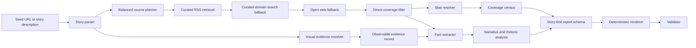

# Dev Branch Diagnosis for the Comey Report Pipeline

## Executive summary

The dev branch is meaningfully closer to what you want, but the latest run still failed in exactly the places that matter most for your use case: source spread, story clarity, visual evidence handling, and final report composition. The uploaded PDF itself says the run is missing `right_side` coverage, and its matrix is dominated by slight-left sources plus one far-left contextual source. It also visibly repeats the Source Matrix and footnotes section near the end, which is not a subtle quality problem; it is a composition bug. fileciteturn90file0 fileciteturn98file0 fileciteturn99file0

The single most important immediate fix is this: your deterministic renderer is currently wrapping the **entire crew report** into the `executive_summary` field and then appending its own Source Matrix and citations. That creates a report-inside-a-report, which explains both the duplicated Source Matrix and a lot of the repetition. In other words, the renderer is not yet rendering structured sections; it is stapling a full free-text report onto a second layout. fileciteturn98file0 fileciteturn99file0

The second most important fix is source policy. The dev branch now has a canonical source registry, a balanced source planner, coverage summaries, relevance scoring, duplicate detection, and a story parser. That is real progress. But the enforcement is still soft. The pipeline can return a partial, ideologically skewed set as long as it reaches the retained-source minimum, even when `strict_bucket_enforcement` is configured. On top of that, your current bucket math counts `-1` and `+1` as “center,” which is not how you are thinking about the problem. In your terms, four `-1` sources is still basically a left-heavy set, not “center coverage.” fileciteturn95file0 fileciteturn96file0 fileciteturn106file0 fileciteturn107file0

The third big fix is visual evidence. Right now the system cannot truly “see the image” in the way you mean. The article extraction stack is text extraction only, and the source context passed into the crew is title/domain/URL/bias plus text excerpts. So if the story hinges on what was visibly in an image or social post—like the shells and the `8647` arrangement tied to a post on entity["company","X","social platform"] by entity["people","James Comey","former fbi director"] about entity["politician","Donald Trump","us president"]—the current pipeline is not giving the model the visual artifact itself. OpenAI’s current API supports image input and structured outputs, but your repo is not yet wiring those capabilities into the acquisition path. fileciteturn105file0 fileciteturn95file0 citeturn0search1turn0search5turn0search6turn1search0turn1search6

My bottom-line recommendation is blunt: fix the report composition bug first, then make balanced source selection truly enforceable, then add a visual-evidence path and a story-first report structure. Until those three things are in place, the model can get smarter and the prompts can get stricter and you will still keep seeing report drift, repeated sections, and one-sided source sets. fileciteturn98file0 fileciteturn99file0 fileciteturn95file0 fileciteturn92file0

## Diagnosis of the latest run

The uploaded PDF already tells you the retrieval result was not good enough. The very first page says the report is missing ideological coverage from the `right_side`, and the Source Matrix shows PBS, USA Today, Yahoo, and WRAL/AP as slight-left entries, plus Common Dreams as a far-left contextual source. That means the system did not merely “miss a perfect balance”; it failed to retrieve a required side at all. fileciteturn90file0

The report also feels repetitive for a concrete reason. It repeats the same core distinction again and again: the indictment is real, the meaning of the post is disputed, and the coverage set is ideologically narrow. Those same ideas appear in Executive Summary, Story Overview, Disputed Facts, Opinion Analysis, Framing & Context Omissions, Fact vs Opinion Ambiguities, Narrative Analysis, Recommended Approach, and Video Outline. Some of that overlap comes from the prompt structure itself, which asks the model to restate similar judgments across many neighboring sections. But the much bigger problem is that the renderer is embedding a full report and then adding another layout around it. fileciteturn90file0 fileciteturn92file0 fileciteturn98file0 fileciteturn99file0

On the image question, your instinct is right. The observable part of the dispute should be separated from the interpretive part. The PDF does eventually say that “the post showed ‘8647’” is an observable-content claim and that the meaning of the number is interpretive, but the surrounding write-up still muddies the distinction by treating the image description itself as though it were part of the core uncertainty. The better structure would be: **what is visibly there**, **who posted it and where**, **what different sides say it means**, and **what legal threshold they claim it meets**. fileciteturn90file0

The duplicate Source Matrix is not your imagination. The PDF shows a Source Matrix in the main body, and then another deterministic source/citation block later in the document. That is exactly what the current `AnalysisService` and `ReportRenderer` combination would produce, because `AnalysisService` creates `ReportSections(executive_summary=crew_report)` and then `ReportRenderer.render()` appends its own Source Matrix and citations afterward. fileciteturn90file0 fileciteturn98file0 fileciteturn99file0

## What the dev branch code is doing wrong

The first root cause is the composition layer. `analysis_service.py` now runs story parsing, source gathering, validation, and deterministic rendering, which is the right direction. But the final step is still only a pass-through: it stores the full CrewAI report in `crew_report`, then builds `ReportSections` with only `executive_summary=crew_report`, and then renders that into a new report shell. The comment in the code even says the full structured `output_pydantic` replacement is still pending. That is why you are getting duplication and “report inside report” behavior. fileciteturn98file0

The second root cause is visual blindness in the evidence path. `ArticleExtractor` extracts title, text, author, date, domain, URL, and extraction metadata. It does not collect embedded-post screenshots, OG image URLs, alt text, attached-media descriptions, or visual OCR. Then `SourceAggregatorService.format_sources_context()` hands the crew a compact text excerpt only. So the model is not being shown the shell arrangement, the image itself, or the post as an image input. OpenAI’s current Responses API and latest models support image inputs and structured JSON outputs, but the repo is not yet using those capabilities in the source pipeline. fileciteturn105file0 fileciteturn95file0 citeturn0search1turn0search5turn0search6turn1search0turn1search6

The third root cause is that your analysis path is still not truly RSS-first. The `news_aggregator` agent does have the RSS tool attached, and the RSS tool now properly supports applying categories even when keywords are present. That is good. But the actual analysis-time source gathering path is `SourceAggregatorService`, and its planner/search flow does not call the RSS tool for balanced evidence gathering. The phase label `rss_curated` is misleading here: in `_search_queries()`, that phase still performs `site:domain` searches through the search engine, not direct RSS retrieval. So the part of the system that matters most for balanced analysis is still search-first, not RSS-first. fileciteturn110file0 fileciteturn111file0 fileciteturn109file0 fileciteturn95file0 fileciteturn96file0

The fourth root cause is your bucket policy. `config/source_registry.yaml` defines `bucket_groups.center_side` as `[-1, 0, 1]`, and `summarize_coverage()` in `SourceAggregatorService` mirrors that by treating `abs(bias) <= 1` as center. That means a source set with four slight-left sources and zero true-center sources can still look “center-present” to the system. If your actual product requirement is “I want at least one real left and one real right, and ideally a true center too,” the current bucket definitions are too permissive. fileciteturn106file0 fileciteturn95file0

The fifth root cause is weak enforcement. `strict_bucket_enforcement` exists in settings, but in the inspected path it does not force a retry or hard fail when required buckets remain missing. `gather_sources()` raises if it cannot reach the retained-source minimum, but not if it reaches 3–5 while still missing an ideological side. Then `AnalysisService` validates and logs warnings, but it still proceeds to render the report. So the current system can knowingly produce a one-sided report and only banner it, which is not the same as enforcing balanced retrieval. fileciteturn107file0 fileciteturn95file0 fileciteturn98file0

The sixth root cause is the exact-bias duplication issue you identified. The scoring function rewards event similarity, empty-bucket filling, domain novelty, factuality, and freshness. It does **not** penalize selecting multiple sources with the same exact bias once that bias is already represented. And because the selection loop backfills from the remaining pool if the missing bucket has no candidates left, it can pad the retained set with more of the same ideological flavor rather than stopping short and admitting the gap. That is how you end up with too many `-1` entries. fileciteturn103file0 fileciteturn95file0

The seventh root cause is story specificity. `StoryParserService` is better than before, but it is still mostly heuristic: first-sentence headline, capitalization-based actor extraction, a short verb list, coarse time windows, and a small query pack. It does not explicitly elevate tokens like quoted numbers, code-like phrases, visual descriptors, social-platform context, or “what is observable versus what is disputed.” For a story whose center of gravity is a social image containing `8647`, that is not enough. fileciteturn100file0

The eighth root cause is direct-coverage filtering. Your sample report included Common Dreams as contextual mention only, and the PDF itself admits it is not direct indictment coverage. The current relevance scorer uses entity overlap, event overlap, time overlap, place overlap, topic match, and novelty, with a low rejection threshold of `0.20`. That leaves room for contextual mention pieces to sneak into the evidence set if they mention the right people and broad event family. You need a distinct “direct coverage vs contextual mention” gate, not just a general relevance score. fileciteturn90file0 fileciteturn101file0

## What the target workflow should become

Your best version of this product should treat evidence gathering as four separate layers: observable facts, direct news reporting, ideological framing, and creator-facing synthesis. Right now those layers bleed into each other too early. The new flow should separate them on purpose. fileciteturn95file0 fileciteturn98file0

The output should also be reordered. The report should **tell the story first**, not ask the reader to reconstruct the story from media-analysis fragments. The best section order for your use case is:

1. **What happened**
2. **What is directly observable**
3. **What is disputed**
4. **Coverage snapshot**
5. **Source matrix**
6. **Bias, framing, rhetoric**
7. **Creator angles / topical takeaways**

That order would have made the Comey run much easier to read, because the reader would have immediately seen: “There was a post, the visible content included a seashell arrangement reading `8647`, the post was on X, the indictment happened, and the dispute is over what `8647` means and whether it constitutes a threat.” Then the outlet framing comes afterward, where it belongs. fileciteturn90file0 fileciteturn92file0

The good news is that the backend already has part of the plumbing for this. `summarize_coverage()` computes left/center/right counts, and `AnalysisService.analyze()` already returns those counts in its response payload. The database model also already has fields for `structured_claims`, `coverage_asymmetry`, and `narrative_json`. So you do not need a ground-up redesign. You need to finish the structured-output handoff and surface the data you are already computing. fileciteturn95file0 fileciteturn98file0 fileciteturn114file0

## Detailed implementation backlog

### Fix the duplicated matrix and report-inside-report bug first

This is the first thing I would hand to the coding agent.

1. Replace the pass-through `ReportSections(executive_summary=crew_report)` with a real structured parse.
   - Create a schema such as `AnalysisReportSections`.
   - Have the report writer return JSON or typed structured output, not full Markdown.
   - Populate `ReportSections` field by field.
   - Do **not** ever pass a full already-rendered report into `ReportRenderer`. fileciteturn98file0 fileciteturn99file0 citeturn1search0turn1search6

2. Add validator checks for duplicate core sections.
   - Fail if the final markdown contains more than one:
     - `Source Matrix`
     - `All Sources & Citations`
     - `Executive Summary`
   - Right now the validator checks URL validity and orphaned footnotes, but not doubled section composition. fileciteturn102file0

3. Add a snapshot test for a rendered report.
   - The existing tests verify prompt strings and task wiring.
   - Add a renderer-level test that ensures exactly one matrix and one footnote block appear in the final markdown. fileciteturn112file0 fileciteturn113file0

### Make source balancing actually enforceable

1. Stop treating `-1` and `+1` as “good enough center” unless you explicitly want center-ish rather than center.
   - I would add a configurable policy:
     - `exact_center_required = true|false`
     - `leftish_group = {-4,-3,-2,-1}`
     - `rightish_group = {1,2,3,4}`
   - For your workflow, I would default to:
     - at least one leftish source
     - at least one rightish source
     - optionally one exact-center source if available
   - That matches how you are actually judging the output. fileciteturn106file0 fileciteturn95file0

2. Enforce `strict_bucket_enforcement` in code, not just in config.
   - After candidate probing completes, if required groups are still missing:
     - either fail the run, or
     - return a “coverage incomplete” status and do not pad with same-side sources
   - Do not silently fill the last slots with more `-1` articles just to hit the retained-source minimum. fileciteturn107file0 fileciteturn95file0

3. Add an exact-bias cap.
   - Default policy:
     - `max_per_exact_bias = 1`
     - `max_per_bucket_group = 2`
   - Optional future feature flag:
     - `allow_same_bias_backfill = true|false`
   - That directly addresses your request to ignore sources from the same bias ranking once one has already been selected. fileciteturn103file0 fileciteturn95file0

4. Change the fallback rule when a required side is missing.
   - If no right-side candidate survives relevance/extraction, do **not** fill with more center-ish or left-ish results by default.
   - Return fewer retained sources plus an explicit missing bucket warning instead.
   - That is better than producing a numerically full but analytically lopsided report. fileciteturn95file0

5. Fix bias-target ordering inside `BalancedSourcePlanner`.
   - Right now the planner builds bucket target lists by iterating raw bias values and then truncating required domains to the first five.
   - That ordering can unintentionally privilege the wrong outlets inside a group, and in the center bucket it will hit `-1` before `0`.
   - Replace this with explicit preference orders:
     - center bucket: `[0, -1, +1]`
     - left bucket: `[-2, -3, -4, -1]` or profile-configurable
     - right bucket: `[+2, +3, +4, +1]`
   - Also randomize or rotate within subgroups over time so you do not repeatedly hit the same small subset of domains. fileciteturn96file0 fileciteturn106file0

### Make the analysis path truly RSS-first

1. Stop labeling a search-engine path as `rss_curated`.
   - In the current inspected code, the `rss_curated` phase uses news search with `site:domain`, not actual RSS retrieval.
   - If you want RSS-first, wire the RSS aggregator into analysis-time source gathering. fileciteturn95file0 fileciteturn96file0 fileciteturn111file0

2. Add an analysis-time RSS retrieval stage that uses the canonical source registry.
   - For each required bucket:
     - pull matching feed items from the curated feed list
     - rank those by story-packet similarity
     - only then fall back to domain search and open web
   - You now have the registry and feed aggregation pieces to do this. fileciteturn97file0 fileciteturn106file0 fileciteturn111file0

3. Keep the `source_aggregator` agent on a tighter leash when `prefetched_sources` is present.
   - The task prompt already says it must use only prefetched sources.
   - In that mode, either remove the search tools or switch to a tool-less analysis-only agent for that step.
   - That reduces prompt drift and useless extra search behavior. fileciteturn92file0 fileciteturn109file0

### Add an observable-evidence layer for images and social posts

1. Create a `VisualEvidenceService`.
   - Input:
     - seed URL
     - embedded social post URL
     - article image URLs
   - Output:
     - `observed_text`
     - `observed_objects`
     - `visible_symbols_or_numbers`
     - `platform`
     - `media_type`
     - `confidence`
     - `source_url`
   - This should produce a structured observation record before ideology analysis begins. fileciteturn105file0 citeturn0search5turn0search6turn1search0turn1search2

2. Extend `ArticleExtractor` to preserve media pointers.
   - Add fields for:
     - `og_image_url`
     - `embedded_post_urls`
     - `image_alt_text`
     - `media_captions`
   - Right now it returns only text-centric metadata. fileciteturn105file0

3. Add a social-post resolver.
   - If the seed or article references a post on X, Instagram, or similar:
     - preserve the canonical post URL
     - capture screenshot or card image
     - pass the image into a vision-capable model
   - This matters specifically for stories where the key argument hinges on what was visibly posted, not just how reporters described it. fileciteturn105file0 citeturn0search1turn0search5turn0search6

4. Split the factual schema into four layers.
   - `observable`
   - `reported_context`
   - `interpretation`
   - `legal_characterization`
   - In the Comey case, the shells/`8647`/X-post layer should live under `observable`, while “this was a threat” belongs under legal/political interpretation. fileciteturn90file0

### Improve story parsing and direct-coverage filtering

1. Upgrade `StoryParserService` to extract distinctive tokens.
   - Add support for:
     - quoted numbers like `8647`
     - short alphanumeric codes
     - social platform names
     - visual descriptors like `seashell photo`
     - exact strings from the seed title or post text
   - Those should enter `must_have_terms`, not just the actor and first verb. fileciteturn100file0

2. Add `must_not_have_terms` more aggressively.
   - If the story is about a threat allegation tied to a social image, reject generic legacy stories about unrelated earlier Comey episodes unless their event markers align.

3. Add a direct-coverage classifier before retention.
   - New field:
     - `coverage_type = direct | contextual | mention | opinion | wire`
   - A contextual mention like the Common Dreams piece in the PDF should not survive into the retained analysis set unless you explicitly ask for contextual background. fileciteturn90file0 fileciteturn101file0

4. Raise the practical rejection bar for contextual drift.
   - `0.20` is permissive.
   - At minimum, require:
     - strong entity overlap
     - strong event overlap
     - direct mention of one or more must-have terms
   - The more politically recurrent a figure is, the harsher the event-specific filter needs to be. fileciteturn101file0

### Add a coverage census and render it in the report

This is one of your better product ideas.

1. Surface the counts you are already computing.
   - `summarize_coverage()` already gives:
     - `left_count`
     - `center_count`
     - `right_count`
     - `probed_count`
     - `retained_count`
     - `duplicate_count`
   - `AnalysisService.analyze()` already returns those fields.
   - Put them into the report. fileciteturn95file0 fileciteturn98file0

2. Expand that into a real coverage census with three layers.
   - `discovered_by_bias`
   - `extractable_by_bias`
   - `retained_by_bias`
   - This is powerful because it separates:
     - what the media ecosystem covered
     - what your pipeline could successfully extract
     - what the final evidence set actually used

3. Track exact bias, not just group.
   - Show counts for:
     - `-4`, `-3`, `-2`, `-1`, `0`, `+1`, `+2`, `+3`, `+4`
   - Then optionally compress to left/center/right for readability.

4. Use the census to explain retrieval failures.
   - Example statuses:
     - “right outlets covered story but extraction failed”
     - “right outlets not found by current queries”
     - “right outlets found but rejected as context/duplicate”
   - That is the level of debugging signal your coding agent needs.

### Reorder the final report so it tells the story before critiquing the coverage

1. Replace the current section order with a story-first layout.
   - `What happened`
   - `What is directly observable`
   - `What is disputed`
   - `Coverage snapshot`
   - `Source matrix`
   - `Bias / rhetoric / omissions`
   - `Creator angles`
   - `Video outline`

2. Merge overlapping sections.
   - Right now too many sections are variations of the same judgment.
   - Consolidate:
     - `Disputed Facts`
     - `Fact vs Opinion Ambiguities`
     - part of `Framing & Context Omissions`
   - into a cleaner:
     - `What is disputed and why`

3. Keep the rhetoric section, but move it down.
   - Users need narrative comprehension before rhetorical audit.

4. Write a short, neutral event narrative from structured evidence only.
   - This should be a dedicated top-of-report synopsis.
   - It should not be recycled from the larger analysis prose.

## Open questions and limitations

I can identify the highest-probability causes of the bad run from the dev-branch code and the uploaded PDF, but I did not inspect live logs for that specific execution, so I cannot prove whether the missing right-side sources were mainly caused by query weakness, search-engine coverage limits, extractor failures, or relevance rejection on that exact run. The current code does not yet expose enough per-bucket diagnostics to close that loop cleanly. fileciteturn95file0 fileciteturn90file0

I also cannot confirm from this evidence alone whether right-leaning outlets materially did cover this exact story in sufficient volume; I can only say the uploaded report failed to retrieve them, while the dev branch registry and planner clearly intend to search across those outlets. That distinction matters, and it is another reason the “coverage census” and per-bucket failure telemetry should be added next. fileciteturn90file0 fileciteturn96file0 fileciteturn106file0

The core verdict is still high confidence: the dev branch contains the right building blocks, but the latest run proves the system is not yet composing those blocks into a clean, balanced, story-first report. Fix the renderer bug first, then enforce bias policy for real, then add the visual-evidence layer. Once those are in place, the rest of the quality problems become much easier to solve. fileciteturn98file0 fileciteturn99file0 fileciteturn95file0